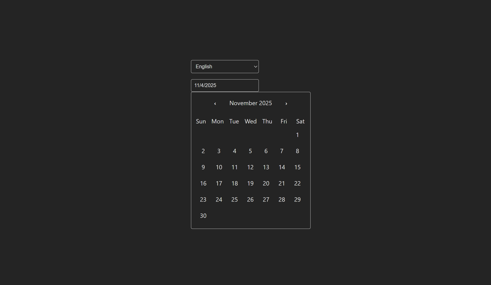

# Calendar

A multilingual calendar component built with Vue 3 and TypeScript.

## Preview



## Technologies

- **Vue 3**
- **TypeScript**
- **CSS**
- **i18n**

## Architecture

```
src/
├── assets/                 # Static assets
├── components/             # Vue components
│   ├── Calendar.vue        # Calendar component
│   ├── Input.vue           # Input component
│   └── Select.vue          # Select component
│
├── i18n.ts                 # Localization configuration
├── main.ts                 # Application entry point
├── App.vue                 # Root component
└── style.css               # Global styles
```

## Development

```bash
# Install dependencies
yarn install

# Start development server
yarn dev

# Build the project
yarn build

# Preview the build
yarn preview
```
